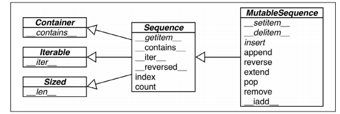

[toc]
# 进步的阶梯

# chap02

## 可变序列 vs 不可变序列
MutableSequence:
list 、 bytearray、 array.array、 collections.deque 和 memoryview
Sequence:
tuple、 str 和 bytes



通过记住这些类的共有特性，把可变与不可变序列或是容器与扁平序列的概念融会贯通，
在探索并学习新的序列类型时，你会更加得心应手

## 拆包
```python
# lc 1310
class Solution:
    def xorQueries(self, arr: List[int], queries: List[List[int]]) -> List[int]:
        P = [0]
        for v in arr:
            P.append(P[-1] ^ v)
        return [P[ed+1]^P[st] for st, ed in queries]

```